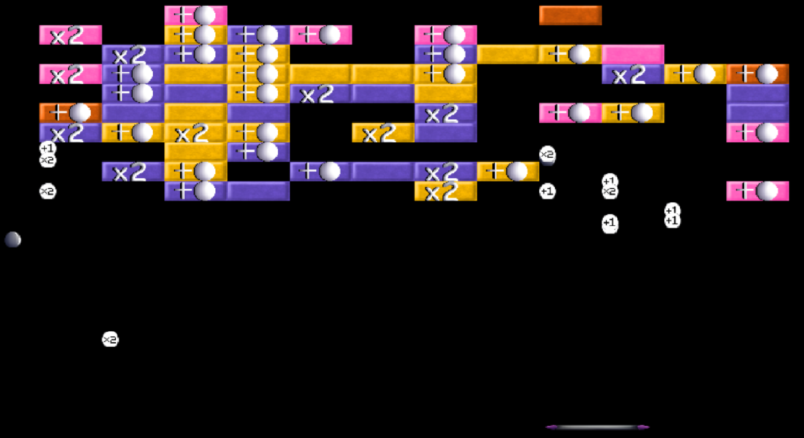

[Back to projects](../README.html)

# DX Ball

Thoth Tech is one of the companies you could join for the Capstone Team Project units at Deakin University. The company mainly works on education software. As someone aiming to enter the software engineering industry, I chose this  company for my Capstone Team Project - where I became the team leader developing the game DX Ball. 

In this project, I built an arcade game with 3 other members during a trimester. Two members including me were mainly working on the code, while the other two worked on the documentation. We worked on this game using the SplashKit library using C++. This game was built to contribute to Thoth Tech's company goals: showcasing the capabilities of SplashKit.

The game is made to be compatible with the arcade machines the company has obtained with the right screen resolution and controls. When the game is run, the player is first greeted with the title screen. After pressing 'R', the game will begin. The player controls the paddle on the bottom of the screen using the 'A' and 'D' keys to keep the balls on the screen. The goal of the game is to clear all the blocks by hitting them with the ball. Some blocks may also have a powerup, either a multiball powerup that gives the player an extra ball, or a score multiplier powerup that increases the score obtained for a period of time. If there is no ball remaining on the screen, the game will be over.

An addition to this game compared to similar games is a ball spawning on top of the screen every five seconds. This was added since the project is aimed to have no longer than three minutes for its duration. 

Here is a recording of the game:
<video controls>
    <source src="../video/dxball-demo.mp4" type="video/mp4">
</video>

[Back to projects](../README.html)