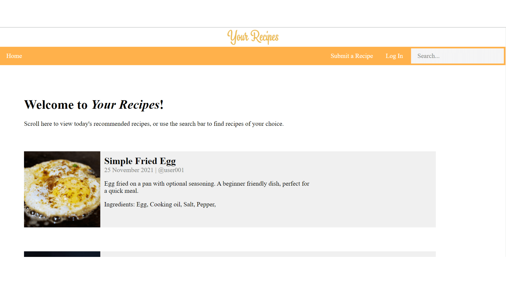

[Back to projects](../swanos.github.io)

# My Recipes

This is a demo recipes website I made for one of my units, where I learned to develop Web applications. This site demonstrates some of my HTML, CSS, and JavaScript skills in year 1 of my degree. I also used the Vue framework to help me create the site.

While the style of *My Recipes* is quite minimalist, the main feature of this site is the search bar. A special thing about the search bar of this site is that you're able to filter in and also filter out ingredients in your search.

[Go here](swanos.github.io/SIT120-IntroToWebApps) to preview the site on your own! *PS: The website looks much better on a computer than on smartphones.*

[Back to projects](../swanos.github.io)