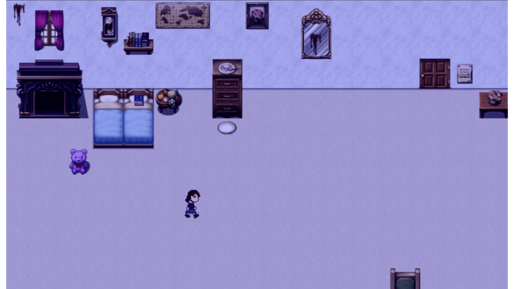

[Back to projects](../swanos.github.io)

# The Land of Our Abandoned Dreams

For a unit in my Game Design minor, my group and I created a demo game titled The Land of Our Abandoned Dreams. This game is an RPG horror game, and the original game idea belongs to one of our team member and friend, Qanita. The story surrounds the main character, a girl who got transported to an abandoned amusement park. By exploring the area, the player learns more about the origin of the park, as well as the girl's past.

We began development of the game from week 5 of the trimester up to week 11, using RPG Maker MV as our main tool. For this project, I took on the Agile Master role, managing the timeline of the project with tasks to prioritize for each member. Of course, I also contributed to two sections of the game, which include a Dining Area and Hall of History, each with their own puzzles.

We also made a demonstration video for our project submission, showcasing all the different areas we have worked on:

Interested in playing the game? Here is a link to [download](https://drive.google.com/file/d/1wvfIgwgQr1WYdf8GEEZYg5pJFUEIUr7R/view?usp=drive_link){:target="_blank"} the game!

It is just a demo, and there's no guarantee that we will ever continue the game to present you with a satisfying ending, but if you're curious of what a group of three university students can make in the span of 7 weeks, give the game a try!

[Back to projects](../swanos.github.io)