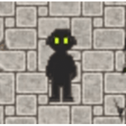
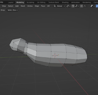

# Hi, I'm Swanny!

Hey there! Welcome to my portfolio. This site is actually still under construction *(not very updated on the projects, unfortunately)*, but you can stay and look around!

In this page are some projects I have worked on. Alternatively, you can also visit [this page](./AboutMe.html) to learn more about me :)

# Projects

**Check out what I have been working on**
- [The Land of Our Abandoned Dreams](Projects/sit254.html)

  

  An RPG horror game I worked on with 2 other team members for a game design assignment made on RPG Maker MV.

- [DX Ball](Projects/dxball.html)

  

  An arcade game I worked on with my team at Thoth Tech using SplashKit, written using C++. 

- [3D Model and Audio Asset Development](Projects/sit253.html)

  

  A set of 3D models and audio that I created for one of my units, Content Creation for Interactive Experiences.

- [My Recipes](Projects/myrecipes.html)

  

  A WebApp I created for one of my units using Vue. Be sure to try filtering ingredients on the search bar!

